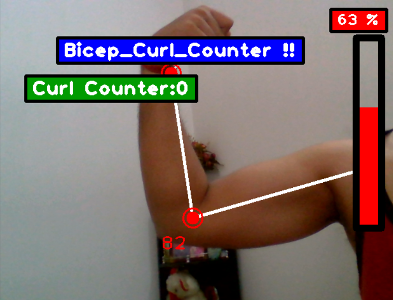

# Bicep Curl Counter

This project is a Python application that uses computer vision to track and count bicep curl repetitions with the right hand using the cvzone and Mediapipe libraries.




## Features

- Activates the webcam to track arm movements.
- Detects and counts bicep curl repetitions in real-time.
- Provides feedback on the number of completed curls.

## Technologies Used

- Python
- OpenCV
- Mediapipe
- cvzone

## Installation

1. Clone the repository:
   ```sh
   git clone https://github.com/yourusername/bicep-curl-counter.git
   cd bicep-curl-counter

2. Install the Libraries:
    ```sh
    pip install -r requirements.txt

## Usage

1. Run the Python script:
   ```sh
   Run the Python script
2. Perform bicep curls in front of your webcam. The application will track your right hand movements and count the repetitions.

## Contributing

1. Contributions are welcome! If you have any suggestions, improvements, or issues, please open an issue or submit a pull request.
